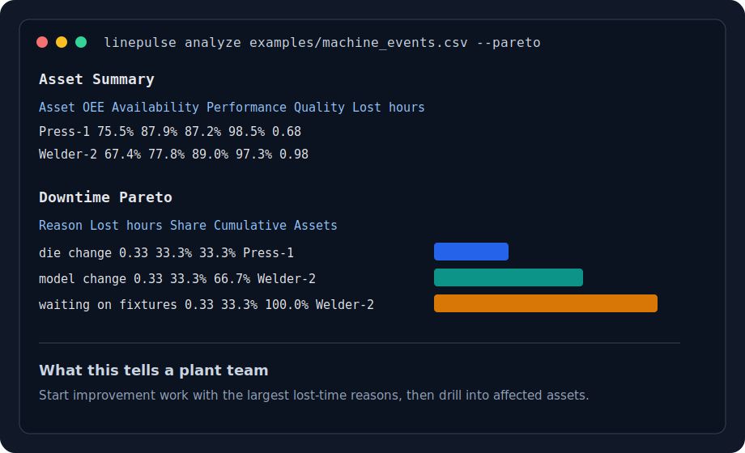
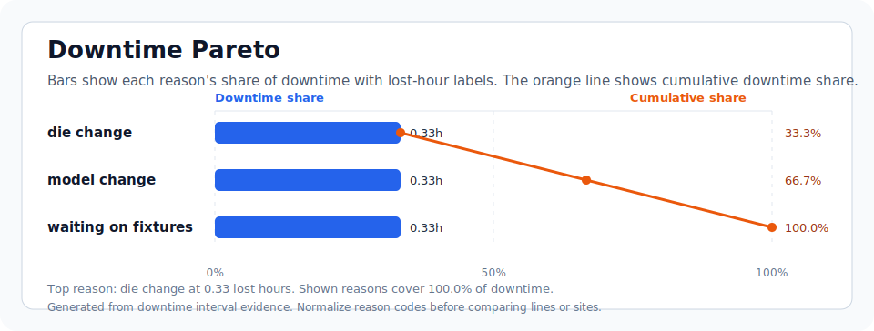

# LinePulse OEE

[](https://github.com/rudy774/linepulse-oee/actions/workflows/tests.yml)
[](LICENSE)
[](pyproject.toml)
[](https://github.com/rudy774/linepulse-oee/releases)

LinePulse OEE is a small open-source toolkit for turning manufacturing event logs into practical OEE, downtime, and bottleneck reports. It is designed for teams that have CSV exports from PLCs, historians, MES systems, or manual downtime logs, but do not yet have a clean analytics layer.

The current toolkit focuses on:

- compute asset-level availability, performance, quality, and OEE
- rank bottlenecks by lost production time
- produce machine-readable JSON and human-readable Markdown reports from a simple CSV
- identify the largest downtime reasons with a plant-level Pareto table
- generate a visual downtime Pareto chart as SVG
- convert starter historian, MES, and manual downtime exports into the LinePulse CSV schema
- validate event CSVs for overlapping intervals, timeline gaps, missing reasons, and count issues

## Why this exists

Many small manufacturers have useful production data trapped in spreadsheets. Commercial OEE products can be too heavy for early continuous-improvement work, while ad hoc spreadsheets are hard to audit. LinePulse OEE gives those teams a transparent baseline they can run, inspect, and extend.

## Quick Start

```powershell
python -m venv .venv
.\.venv\Scripts\Activate.ps1
pip install -e .
linepulse analyze examples/machine_events.csv --markdown reports/oee.md --json reports/oee.json
```

You can also run it without installing:

```powershell
python -m linepulse_oee.cli analyze examples/machine_events.csv --markdown reports/oee.md
```

## Input Format

LinePulse reads CSV files with one row per machine state interval:

```csv
asset,start,end,state,reason,good_count,scrap_count,ideal_cycle_seconds
Press-1,2026-06-01T06:00:00,2026-06-01T06:45:00,running,,520,8,4.5
Press-1,2026-06-01T06:45:00,2026-06-01T07:05:00,downtime,die change,0,0,4.5
```

Supported `state` values are:

- `running`
- `downtime`
- `planned_stop`
- `idle`
- `changeover`

Rows marked `planned_stop` are excluded from planned production time. Rows marked `running` contribute runtime and part counts. Other non-planned rows count as downtime or lost time.

See [docs/data-schema.md](docs/data-schema.md) for the full schema.

## CLI

Create a starter CSV:

```powershell
linepulse template > machine_events.csv
```

Convert a supported source export into LinePulse's event schema:

```powershell
linepulse convert examples/adapters/ignition_historian_export.csv --adapter ignition-historian --output reports/ignition_events.csv
```

Validate a machine event CSV before analysis:

```powershell
linepulse validate examples/machine_events.csv
```

Analyze a file and print a compact summary:

```powershell
linepulse analyze examples/machine_events.csv
```

Print the downtime Pareto table too:

```powershell
linepulse analyze examples/machine_events.csv --pareto
```

Use a shift calendar to derive planned production time from scheduled shifts and breaks:

```powershell
linepulse analyze examples/machine_events.csv --calendar examples/shift_calendar.json --pareto
```

Normalize messy downtime reason labels before Pareto reporting:

```powershell
linepulse analyze examples/machine_events.csv --reason-map examples/reason_codes.json --pareto
```

Write JSON and Markdown reports:

```powershell
linepulse analyze examples/machine_events.csv --json reports/oee.json --markdown reports/oee.md
```

Generate a visual downtime Pareto chart:

```powershell
linepulse analyze examples/machine_events.csv --pareto-svg reports/pareto.svg
```

## Example Output

```text
Asset      OEE    Availability  Performance  Quality  Lost hours
Press-1    71.8%  83.3%         87.9%        98.0%    0.65
Welder-2   64.4%  76.9%         86.3%        97.0%    0.93
```

Markdown and JSON reports include a `Downtime Pareto` section that ranks downtime reasons by lost hours, share of downtime, cumulative share, and affected assets.

Shift calendars are documented in [docs/shift-calendars.md](docs/shift-calendars.md).
Reason-code normalization is documented in [docs/reason-codes.md](docs/reason-codes.md).
Adapter examples are documented in [docs/adapters.md](docs/adapters.md).
Pareto charts are documented in [docs/pareto-charts.md](docs/pareto-charts.md).
CSV validation is documented in [docs/validation.md](docs/validation.md).
Manufacturing design principles are documented in [docs/manufacturing-design-principles.md](docs/manufacturing-design-principles.md).

## Sample Report



## Sample Pareto Chart



## Roadmap

- takt targets
- notebook examples for continuous improvement reviews
- run and shift context improvements
- more real-world adapter fixtures for common historian and MES exports
- optional web dashboard for non-technical users

## Contributing

Contributions are welcome, especially sample schemas from real manufacturing systems, test CSVs, documentation improvements, and adapters. See [CONTRIBUTING.md](CONTRIBUTING.md).

## License

MIT License. See [LICENSE](LICENSE).
